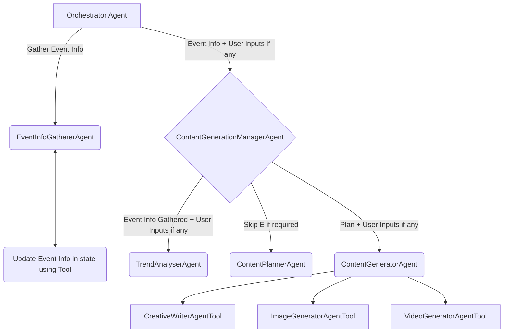

```mermaid
flowchart TD
    A[Orchestrator Agent] -->|Gather Event Info| B(EventInfoGathererAgent)
    B <--> C(Update Event Info in state using Tool)
    A --> |Event Info + User inputs if any|D{ContentGenerationManagerAgent}
    D -->|Event Info Gathered + User Inputs if any| E(TrendAnalyserAgent)
    D-->|Skip E if required| G(ContentPlannerAgent)
    D -->|Plan + User Inputs if any| F(ContentGeneratorAgent)
    F -->H[CreativeWriterAgentTool]
    F -->I[ImageGeneratorAgentTool]
    F -->J[VideoGeneratorAgentTool]
```