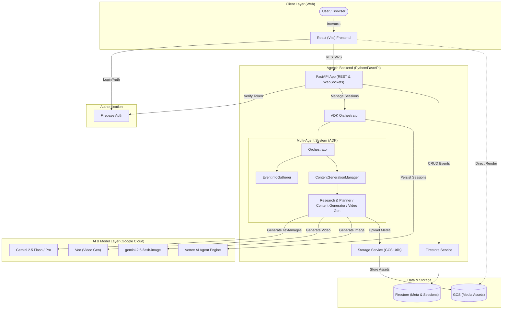

# Evento System Architecture

The following diagram illustrates the high-level architecture of Evento, highlighting the relationships between the frontend, the agentic backend, and Google Cloud services.

## Architectural Highlights

- **Multimodal Response Pipeline**: Agents generate native content (text, images, and video) which is intercepted by ADK callbacks, uploaded to Google Cloud Storage, and transformed into a structured JSON response for real-time rendering on the frontend.
- **Agentic Orchestration**: Evento uses the **Agent Development Kit (ADK)** to build a directed acyclic graph (DAG) of specialized agents. This allows for complex, multi-turn reasoning and specialized tool usage (like Google Search grounding).
- **Scalable Media Handling**: By using GCS directly for media assets and bypassing Base64 encoding over WebSockets, Evento ensures high performance and prevents session state bloat.
- **Cloud-Native Integration**: The entire stack is built to be deployed on **Cloud Run**, leveraging **Vertex AI** for industry-leading generative capabilities and **Firebase** for secure, easy-to-manage authentication.
