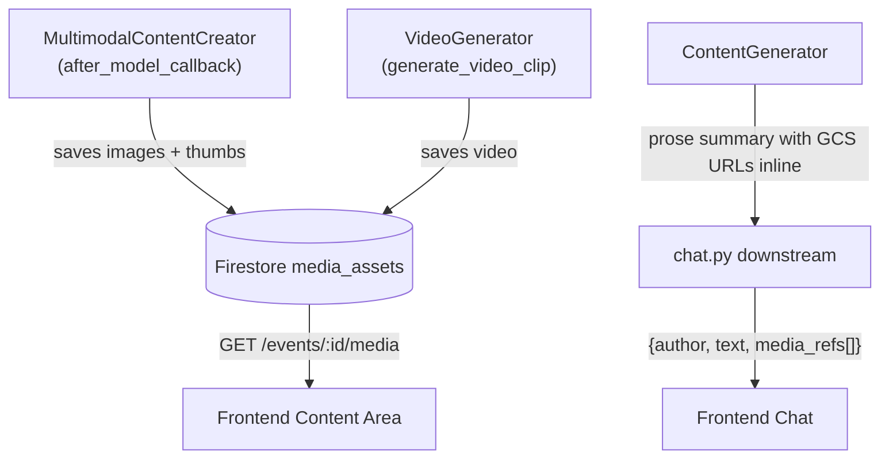

# Structured Multimodal Response Pipeline (v4 — Final)

Enable the frontend to receive and render interleaved text, images, and videos from the agent backend.

## Problem

[chat.py](file:///Volumes/Jaaga1/repos/evento/apps/agent_service/app/api/chat.py) L113-119 extracts only `.text` parts and sends flat `{type, author, text}`. Images/videos (GCS URLs) are embedded inside text as JSON strings → frontend can't render them as media elements.

## Key Design Decisions

### 1. Hackathon Compliance ✅

`MultimodalContentCreator` uses `gemini-2.5-flash-image` for native interleaved text + image generation.

### 2. Hybrid Approach (Reliability-First)

ContentGenerator **stays prose-only**. Content area populated from **Firestore `media_assets`**, not LLM output.



### 3. Thumbnail-to-Card Linking ✅

The Firestore `asset_id` (auto-generated document ID) acts as the **shared key** between chat thumbnails and content cards:

1. `after_model_callback` saves image → gets `asset_id` from Firestore
2. [chat.py](file:///Volumes/Jaaga1/repos/evento/apps/agent_service/app/api/chat.py) sends `media_refs: [{asset_id, url, thumbnail_url}]` via WebSocket
3. Chat renders thumbnail with `contentId = asset_id`
4. Content area renders [ContentCard](file:///Volumes/Jaaga1/repos/evento/apps/web/src/components/eventspace/ContentCard.tsx#47-241) with `id = asset_id` (from `GET /events/{event_id}/media`)
5. Click thumbnail → [handleMediaClick(asset_id)](file:///Volumes/Jaaga1/repos/evento/apps/web/src/pages/EventSpacePage.tsx#145-153) → `scrollIntoView("content-card-{asset_id}")` ✅

### 4. GCS URL Serving — Public-Read

`gs://bucket/path` → `https://storage.googleapis.com/bucket/path` before sending to client.

> [!WARNING]
> **Post-hackathon:** Switch to signed URLs or CDN with auth. Add disclaimer to README.md.

### 5. Chat History — ADK `session_service`

`session_service.get_session()` → `session.events` for chat reconstruction on page refresh. No separate Firestore chat collection.

### 6. Media Asset Schema

New Firestore collection `media_assets` — tracks **both user-uploaded and agent-generated** assets:

```
media_assets/{auto_id}     ← this ID is the shared linking key
├── event_id: string
├── session_id: string
├── source: "user_upload" | "agent_generated"
├── asset_type: "image" | "video" | "document"
├── subtype: "thumbnail" | null
├── parent_asset_id: string | null
├── gcs_path: string
├── public_url: string
├── content_category: "poster" | "email" | "social_post" | "video" | "attachment"
├── title: string
├── mime_type: string
├── rich_content: string | null       (email body HTML/markdown, social copy, etc.)
├── subject: string | null            (email subject line)
├── created_at: timestamp
```

**Email content** is stored via `rich_content` (the full email body as markdown/HTML) and `subject`. When the frontend renders an email [ContentCard](file:///Volumes/Jaaga1/repos/evento/apps/web/src/components/eventspace/ContentCard.tsx#47-241), it reads these fields directly from the media asset record.

---

## Proposed Changes

### Backend — Steps 1-6

---

#### Step 1: [MODIFY] [helpers.py](file:///Volumes/Jaaga1/repos/evento/apps/agent_service/app/utils/helpers.py)

Extend [process_image](file:///Volumes/Jaaga1/repos/evento/apps/agent_service/app/utils/helpers.py#11-43) with optional `max_width` and `dest_prefix` params for thumbnail generation. Reusable for both user uploads and generated content.

#### Step 2: [MODIFY] [firestore_service.py](file:///Volumes/Jaaga1/repos/evento/apps/agent_service/app/services/firestore_service.py)

Add:
- `save_media_asset(asset_data) → asset_id` — returns the auto-generated document ID
- `get_media_for_event(event_id, session_id=None)` — filterable by both

#### Step 3: [MODIFY] [multimodal_content_creator.py](file:///Volumes/Jaaga1/repos/evento/apps/agent_service/app/agents/multimodal_content_creator.py)

Update `after_model_callback`:
1. Generate thumbnails via [process_image(bytes, max_width=200)](file:///Volumes/Jaaga1/repos/evento/apps/agent_service/app/utils/helpers.py#11-43)
2. Save full + thumbnail to `media_assets`, get `asset_id`
3. Inject `asset_id` into the response JSON so [chat.py](file:///Volumes/Jaaga1/repos/evento/apps/agent_service/app/api/chat.py) can extract it

#### Step 4: [MODIFY] [video_tool.py](file:///Volumes/Jaaga1/repos/evento/apps/agent_service/app/tools/video_tool.py)

Save video asset to `media_assets` after Veo generation, include `asset_id` in return.

#### Step 5: [MODIFY] [chat.py](file:///Volumes/Jaaga1/repos/evento/apps/agent_service/app/api/chat.py)

Replace flat text extraction:
1. Extract text parts
2. Convert `gs://` URLs → public HTTP URLs in text
3. Build `media_refs[]` with `{asset_id, url, thumbnail_url, asset_type}` from response JSON
4. Send `{type: "message", author, text, media_refs}`
5. New: `GET /chat/{session_id}/history` → `session_service.get_session()` → serialize events

#### Step 6: [NEW] [app/api/media.py](file:///Volumes/Jaaga1/repos/evento/apps/agent_service/app/api/media.py)

- `GET /events/{event_id}/media?session_id=...` — list media assets
- `POST /events/{event_id}/media` — record user-uploaded assets

---

### Frontend — Steps 7-9

---

#### Step 7: [NEW] [src/types/chat.ts](file:///Volumes/Jaaga1/repos/evento/apps/web/src/types/chat.ts)

```typescript
// Server → client
interface WsAgentMessage {
  type: 'message';
  author: string;
  text: string;                      // Prose (markdown-renderable)
  media_refs?: MediaRef[];           // Linked to content cards via asset_id
}

interface MediaRef {
  asset_id: string;                  // Firestore doc ID = ContentCard ID
  url: string;
  thumbnail_url?: string;
  mime_type: string;
  asset_type: 'image' | 'video' | 'document';
}

// Client → server (supports multiple attachments)
interface WsUserMessage {
  text: string;
  attachments?: Attachment[];        // Zero or more files
}

interface Attachment {
  url: string;                       // GCS URL after upload
  mime_type: string;                 // "image/jpeg", "application/pdf", etc.
}
```

#### Step 8: [MODIFY] [ChatMessage.tsx](file:///Volumes/Jaaga1/repos/evento/apps/web/src/components/eventspace/ChatMessage.tsx)

- Render `text` with `react-markdown`
- Render `media_refs` as clickable thumbnails (click → [handleMediaClick(asset_id)](file:///Volumes/Jaaga1/repos/evento/apps/web/src/pages/EventSpacePage.tsx#145-153) scrolls to card)
- Support multiple attachment previews in user messages

#### Step 9: [MODIFY] [EventSpacePage.tsx](file:///Volumes/Jaaga1/repos/evento/apps/web/src/pages/EventSpacePage.tsx)

- On mount: `GET /events/{event_id}/media` → [ContentCard](file:///Volumes/Jaaga1/repos/evento/apps/web/src/components/eventspace/ContentCard.tsx#47-241) components (each with `id={asset.id}`)
- On mount: `GET /chat/{session_id}/history` → reconstruct chat
- On WebSocket media: optimistic append new cards to content area
- [handleMediaClick(assetId)](file:///Volumes/Jaaga1/repos/evento/apps/web/src/pages/EventSpacePage.tsx#145-153) → `scrollIntoView("content-card-{assetId}")` (unchanged)

---

## Verification Plan

### Manual
- Request "create a poster" → chat shows prose + thumbnail. Content area shows card. Click thumbnail → card scrolls into view ✅
- Upload multiple images + PDF → all appear as attachments in user message
- Refresh page → chat history + content area reconstruct correctly
- Email content card → shows subject + rich body text + hero image
